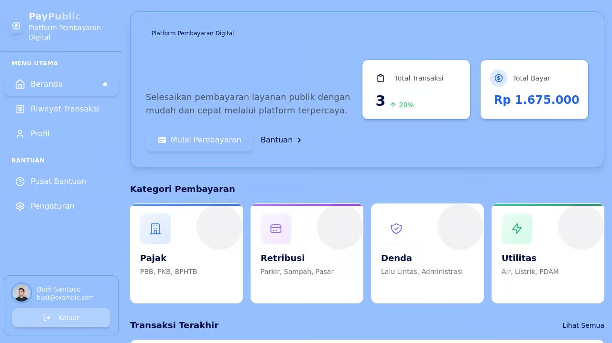
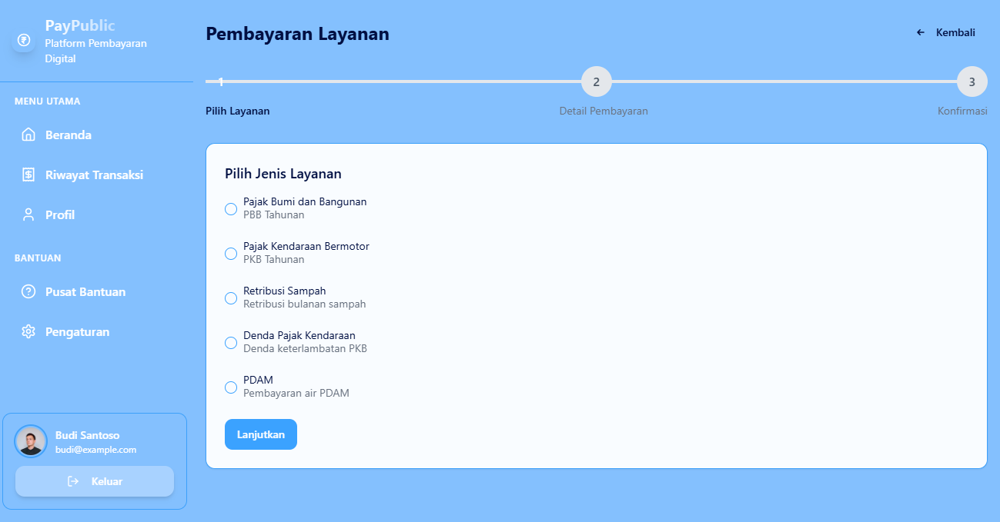
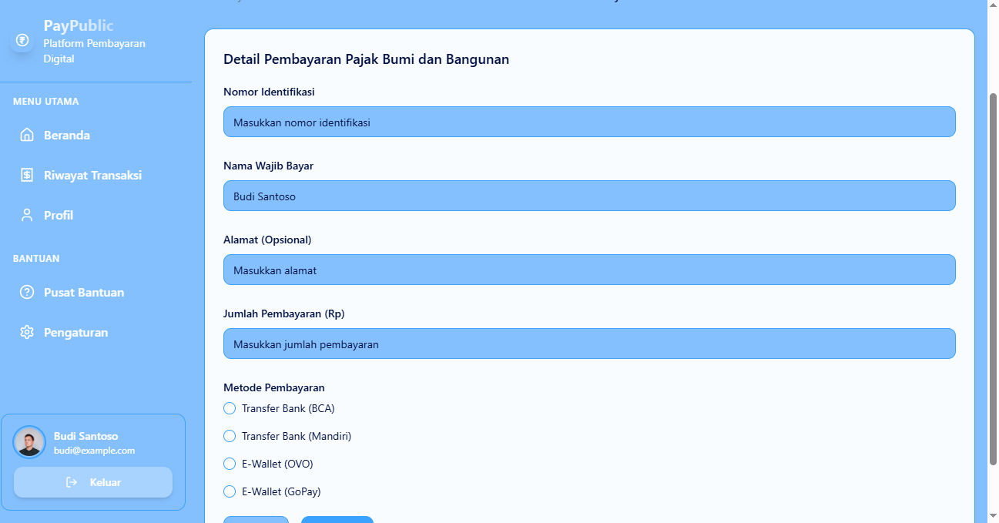
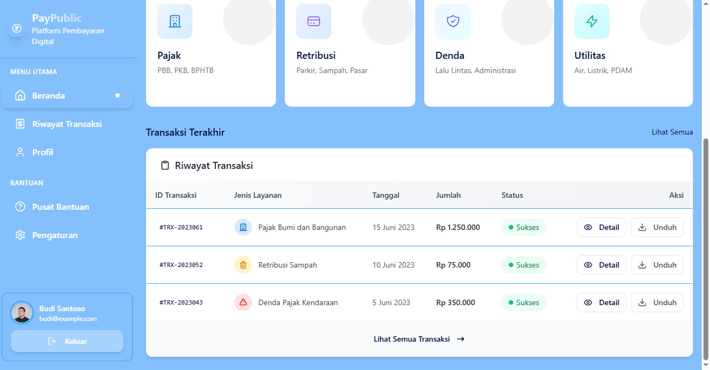

# Platform Pembayaran Digital Terintegrasi

Platform pembayaran digital untuk integrasi berbagai layanan publik di Indonesia termasuk pajak, retribusi, dan denda.







## Fitur Utama

✅ **Dashboard Terintegrasi** - Visualisasi data transaksi dan pembayaran dalam satu layar
✅ **Alur Pembayaran Intuitif** - Proses pembayaran yang mudah dengan 3 langkah sederhana
✅ **Manajemen Transaksi** - Lihat riwayat dan status pembayaran dengan mudah
✅ **Autentikasi Pengguna** - Sistem masuk dan pendaftaran dengan keamanan tinggi
✅ **Kategori Pembayaran** - Pilihan layanan yang terorganisir berdasarkan kategori
✅ **Receipt Generator** - Bukti pembayaran digital yang bisa diunduh

## Teknologi yang Digunakan

- **Frontend**: React, TypeScript, TailwindCSS, shadcn/ui
- **Backend**: Express, Node.js
- **State Management**: React Query (Tanstack Query)
- **Routing**: Wouter
- **Database**: Penyimpanan In-Memory (dapat ditingkatkan ke Postgres)
- **Form Handling**: React Hook Form dengan validasi Zod

## Struktur Aplikasi

Aplikasi ini mengikuti arsitektur modern dengan komponen yang terorganisir:

```
├── client/            # Frontend React application
│   ├── components/    # Reusable UI components
│   ├── hooks/         # Custom React hooks
│   ├── lib/           # Utilities and configuration
│   ├── pages/         # Main application pages
│   └── utils/         # Helper functions
├── server/            # Backend Express server
│   ├── routes.ts      # API endpoints
│   └── storage.ts     # Data storage layer
└── shared/            # Shared code between client and server
    └── schema.ts      # Data models and validation schemas
```

## Halaman dan Fitur

### Dashboard
- Tampilan ringkasan transaksi terbaru
- Statistik dan grafik pembayaran
- Navigasi cepat ke semua fitur

### Alur Pembayaran
1. **Pilih Kategori Layanan** - Pajak, Utilitas, Pendidikan, atau Retribusi
2. **Isi Detail Pembayaran** - Nomor identifikasi, jumlah, dan informasi penting lainnya
3. **Konfirmasi dan Selesaikan** - Tinjau detail dan selesaikan pembayaran

### Riwayat Transaksi
- Daftar semua transaksi dengan status (Sukses, Pending, Gagal)
- Filter dan pencarian untuk menemukan transaksi tertentu
- Unduh bukti pembayaran digital

## Pengembangan Fase Selanjutnya

1. Integrasi API Pemerintah untuk data pembayaran real-time
2. Dashboard analitik dan pelaporan lanjutan
3. Peningkatan keamanan dengan autentikasi multi-faktor
4. Pengembangan aplikasi mobile (Android & iOS)

## Memulai Aplikasi

1. Clone repositori ini
2. Instal dependensi: `npm install`
3. Jalankan aplikasi: `npm run dev`
4. Akses aplikasi di browser: `http://localhost:5000`

## Kontributor

- Tim Pengembang Platform Pembayaran Digital

## Lisensi

Hak Cipta © 2025 Platform Pembayaran Digital Terintegrasi